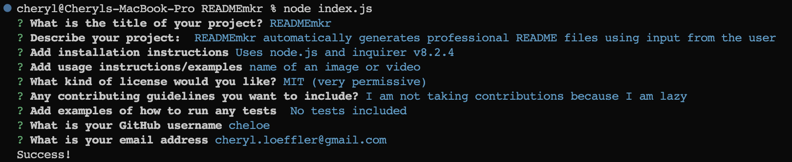

# READMEmkr
A simple markdown generator for README.md files. Uses Inquirer.js to prompt the user for information about their project and then generates a README.md file based on the user's input.

 

# Here's what I did:
- Wrote Inquirer prompts to ask the user for information about their project.
- Wrote a function to generate the README.md file based on the user's input.
- Wrote a function to write the README.md file to the user's current directory.
- Wrote a function that formats the user's input into a markdown file.
- Formatted Markdown links. Added badges, table of contents, etc. Made table of contents links work, made badges link to the appropriate pages, and made the github username link to the user's github page.
- Made a video demonstrating the functionality of the app.

 

# Video Demonstration:

 [Link to video](https://drive.google.com/file/d/1e4Gf9YiUBR1HZJcnRyat3hvOfXZeonvL/view)

 

# Github Repository:

[READMEmkr](https://github.com/Cheloe/READMEmkr)

 

# Screenshots:
 
Inquirer prompts:

  
